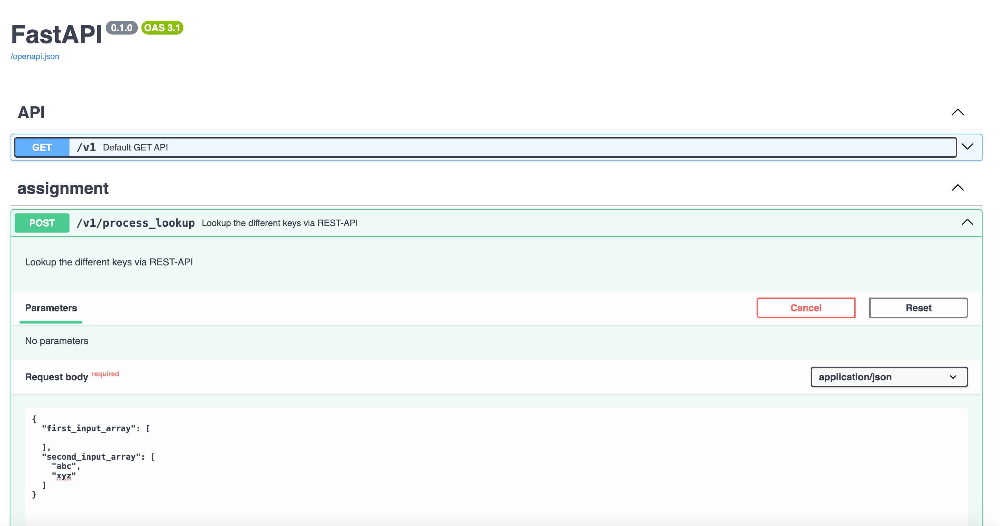

# python-assignment
python-assignment (Deadline: Wednesday, November 15)


### Assignment
- Please use a well-known programming language such as Perl, C++, Java, Python, or PHP to develop code that takes two input files. --> __<i>Choose python environment with REST_API and Script for lookup the different keys from the source or files</i>__
-  Both input files consist of lines sorted in lexicographically ascending order based on ASCII values. The code should produce two output files:
- The first output file should contain lines that are present in the first input file but not in the second input file.
- The second output file should contain lines that are present in the second input file but not in the first input file.
- Solution: __<i>I have two ways(1. REST-API based: <i>https://github.com/euiyounghwang/python-assignment/blob/master/service_start.sh</i>, Run Script: <i>https://github.com/euiyounghwang/python-assignment/blob/master/run-script.sh</i>) to find different things in different files or strings using SWAGGER and Script</i>__

### Install Poerty
```
https://python-poetry.org/docs/?ref=dylancastillo.co#installing-with-the-official-installer
```

### Using Python Virtual Environment
```bash
python -m venv .venv
source .venv/bin/activate
```

### Using Poetry
- Create the virtual environment in the same directory as the project and install the dependencies with pytest:
```bash
poetry config virtualenvs.in-project true
poetry init
poetry add fastapi
poetry add uvicorn
poetry add pytz
poetry add pytest
poetry add pytest-cov
poetry add python-dotenv
poetry add httpx
poetry add asyncio
poetry add pytest-asyncio
```

### Dataset
- Use dataset from 'https://raw.githubusercontent.com/dwyl/english-words/master/words.txt'

### Soultion1: Test two json array for the logic on Swagger for RESTAPI
- Developing an API for task performance testing (extracting results by comparing two lists through parallel processing)
- Run FastAPI based REST-API : <i>https://github.com/euiyounghwang/python-assignment/blob/master/service_start.sh</i>

```bash
API URL : http://localhost:7091/v1/process_lookup (POST)

- INPUT JSON : {
  "first_input_array": [
    
  ],
  "second_input_array": [
    "abc",
    "xyz"
  ]
}

- OUTPUT : {
  "result": {
    "first_input_array_lookup": [
      "abc",
      "xyz"
    ],
    "second_input_array_lookup": []
  }
}
```

### Soultion2: Run the script for extract the different work in the file
- I performed file processing on an asynchronous basis to improve performance when performing the assignment
- Run Script : <i>https://github.com/euiyounghwang/python-assignment/blob/master/run-script.sh</i>
- Performed logic verification through pytest (<i>https://github.com/euiyounghwang/python-assignment/blob/master/pytest.sh</i>).


### Pytest
```bash
(.venv) ➜  python-assignment git:(master) ./pytest.sh
==================================================== test session starts ====================================================
platform darwin -- Python 3.9.7, pytest-7.4.3, pluggy-1.3.0 -- /Users/euiyoung.hwang/ES/Python_Workspace/python-assignment/.venv/bin/python
cachedir: .pytest_cache
rootdir: /Users/euiyoung.hwang/ES/Python_Workspace/python-assignment/tests
configfile: pytest.ini
plugins: cov-4.1.0, anyio-3.7.1
collected 5 items                                                                                                           

tests/test_api.py::test_mock_api PASSED                                                                               [ 20%]
tests/test_api.py::test_mock_lookup_api PASSED                                                                        [ 40%]
tests/test_lookup.py::test_skip SKIPPED (no way of currently testing this)                                            [ 60%]
tests/test_lookup.py::test_sample_string_sort PASSED                                                                  [ 80%]
tests/test_lookup.py::test_read_file_sort PASSED                                                                      [100%]
```